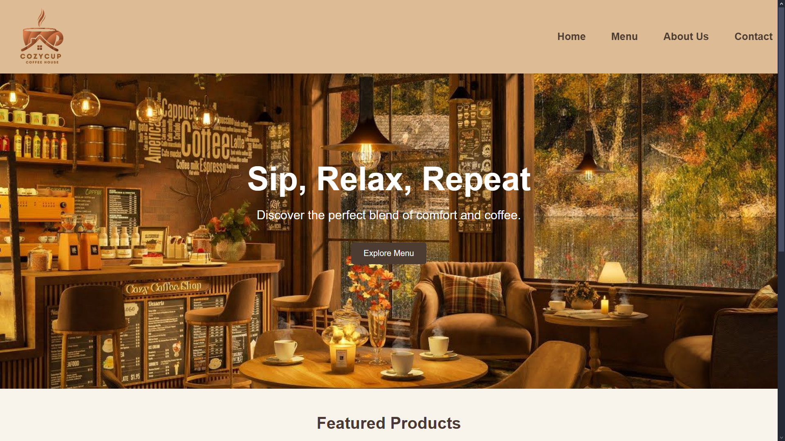
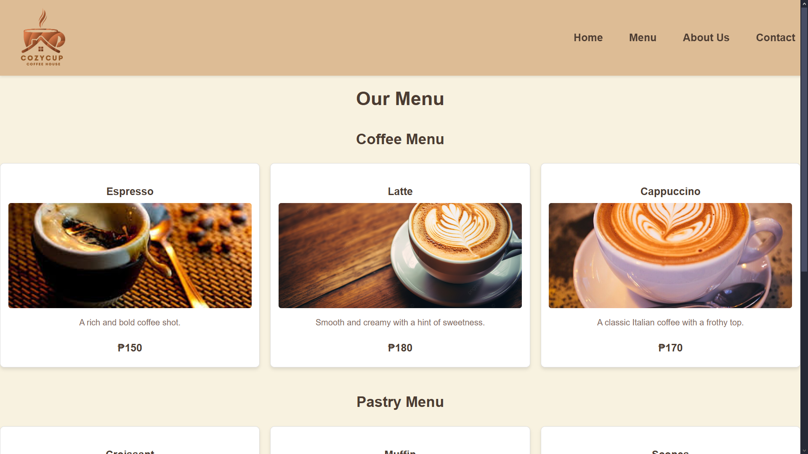
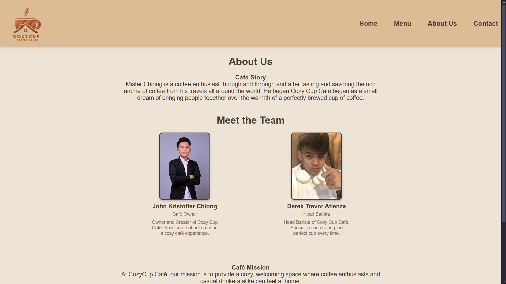
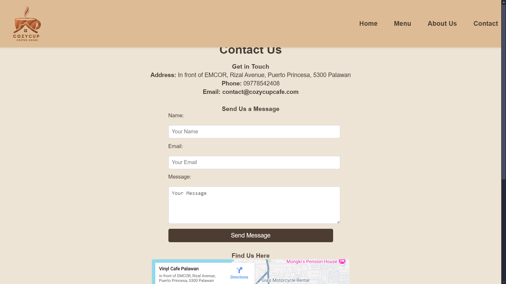
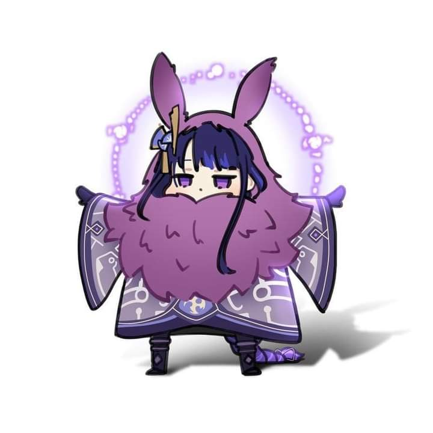

<h1>Project Description</h1>
<h3>Cozy Cup Cafe is a test website to test out collaborating on Github for our course CC-6 (Application Development and Emerging Technologies 1). I, and John Kristoffer Chiong are the people involved
in this project.</h3>
<h1>Features</h1>
<ul>
<li>Newsletter Subscription</li>
<li>Quick Links for Social Media Pages</li>
<li>Embedded Google Maps Location of the Cafe</li>
</ul>
<h1>Screen Captures</h1>

<strong>Home Page</strong> - this contains the button that redirects to the menu, a featured products section that proudly displays the Cafe's bestsellers.

<strong>Menu Page</strong> - images of the coffee and pastry menu are displayed here with a brief description and the price for the each respective product.

<strong>About Page</strong> - us, creators of the project. A brief story of the cafe and it's mission.

<strong>Contact Page</strong> - contains the contact information of the cafe and a way to send them a message for reviews. Also displays the location of the cafe so users can screenshot it if they plan on visiting.

<h1>About the Authors</h1>

<strong>Name:</strong> Derek Trevor N. Atienza  
<strong>Email:</strong> 202180173@psu.palawan.edu.ph   

<strong>Name: John Kristoffer C. Chiong</strong> 
<strong>Email: 202280002@psu.palawan.edu.ph</strong>  

